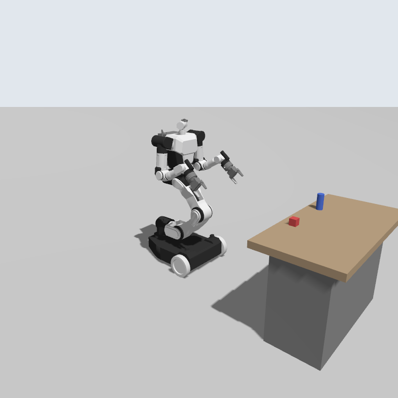

# RB-Y1 Gazebo Simulation (ROS 2 Humble + Gazebo Harmonic)

Part of [tccc_hmlv_automation_sim](../README.md). Everything below is relative to
this directory (`rainbowrobotics_rby1/`), which is its own colcon workspace.
Formerly the standalone repo `artc-asr/artc_rainbowrobotics_rby1`.

A Gazebo counterpart to [rby1-sim-isaac](https://github.com/RainbowRobotics/rby1-sim-isaac)
for the Rainbow Robotics **RB-Y1 Model A v1.2** (the same model as Isaac's `model_v_1_2_a.usd`).



## Packages

| Package | Contents |
|---|---|
| `rby1_description` | URDF + meshes converted from the official [rby1-sdk](https://github.com/RainbowRobotics/rby1-sdk) `models/rby1a/urdf/model_v1.2.urdf`, RViz display launch |
| `rby1_gazebo` | Gazebo world, ros2_control config, sensors, ROS↔Gazebo bridge, demo script |
| `gz_ros2_control` | symlink to [`../third_party/gz_ros2_control`](../third_party/README.md): upstream `humble` branch, built from source **against Harmonic** (the apt package `ros-humble-gz-ros2-control` targets Fortress and does not work with `ros-humble-ros-gzharmonic`) |

## Build

```bash
cd tccc_hmlv_automation_sim/rainbowrobotics_rby1
source source_sim.sh build   # colcon build with GZ_VERSION=harmonic (required by gz_ros2_control)
source source_sim.sh         # every new terminal (use a fresh one, not a Moz1 / G1 shell)
```

Or from the repo root without sourcing anything: `./sim.sh rby1 build`, then `./sim.sh rby1 [args]`.

Prerequisites (already on this machine): `ros-humble-ros-gzharmonic`, `ros-humble-ros2-control`,
`ros-humble-ros2-controllers`, `ros-humble-xacro`, `libgz-sim8-dev`, `libgz-plugin2-dev`.

## Run

```bash
ros2 launch rby1_gazebo rby1_sim.launch.py                        # headless Gazebo, RViz viewer (default)
ros2 launch rby1_gazebo rby1_sim.launch.py gui:=true              # + Gazebo GUI window
ros2 launch rby1_gazebo rby1_sim.launch.py gui:=true rviz:=false  # Gazebo GUI only
```

With the Gazebo GUI off, `world_markers.py` draws the world's table and objects in RViz
(movable objects follow the simulation), and `world → odom` is published from the spawn pose.

Launch arguments: `world:=<sdf>`, `x:=`, `y:=`, `z:=`, `yaw:=`, `gui:=` (default false), `rviz:=` (default true).

In a second terminal:

```bash
ros2 run rby1_gazebo rby1_demo.py      # ready pose, head, grippers, short drive
ros2 run teleop_twist_keyboard teleop_twist_keyboard   # drive with /cmd_vel
```

URDF only (no physics): `ros2 launch rby1_description display.launch.py`

> **Running other ROS/Gazebo sims at the same time?** Give each its own domain, e.g.
> `export ROS_DOMAIN_ID=42 GZ_PARTITION=rby1` in every terminal of this sim. Two
> `/controller_manager` / `/robot_state_publisher` nodes on one domain will collide.

## ROS interfaces

| Topic / action | Type | Notes |
|---|---|---|
| `/cmd_vel` | `geometry_msgs/Twist` | diff-drive base (max 1.5 m/s, 2 rad/s) |
| `/odom`, TF `odom → base_footprint` | `nav_msgs/Odometry` | wheel odometry |
| `/joint_states` | `sensor_msgs/JointState` | all 28 joints |
| `/{torso,right_arm,left_arm,head}_controller/follow_joint_trajectory` | `control_msgs/FollowJointTrajectory` | position control |
| `/{right,left}_gripper_controller/follow_joint_trajectory` | same | fingers: `r1/l1 ∈ [-0.05, 0]`, `r2/l2 ∈ [0, 0.05]`, 0 = closed |
| `/head_camera/{image,depth_image,camera_info}` | `sensor_msgs` | 640×480 @ 15 Hz, frame `head_camera_optical_frame` |
| `/imu` | `sensor_msgs/Imu` | 100 Hz on `imu_link` (base) |

Quick trajectory command example:

```bash
ros2 action send_goal /head_controller/follow_joint_trajectory control_msgs/action/FollowJointTrajectory \
  "{trajectory: {joint_names: [head_0, head_1], points: [{positions: [0.5, 0.3], time_from_start: {sec: 2}}]}}"
```

Joint names match rby1-sdk / Isaac (`right_wheel, left_wheel, torso_0..5, right_arm_0..6, left_arm_0..6, head_0..1`).

## What was changed vs. the SDK URDF

`rby1_description/scripts/sdk_urdf_to_ros.py` regenerates `urdf/rby1a_body.urdf.xacro`
from `sdk_urdf/rby1a_v1.2.urdf`:

- **Capsule collisions → cylinder + 2 spheres** (ROS URDF has no `<capsule>`).
- **Added collisions** the SDK URDF lacks: wheels (r = 0.10 m cylinders), chassis box,
  two frictionless rear caster spheres, gripper body and finger boxes (sized from the
  rby1-sdk MuJoCo collision meshes).
- Mesh paths → `package://rby1_description/meshes/rby1a/…`, wheel effort limit (60 N·m) added,
  non-standard `<mobile>` element / attributes removed.

`rby1.urdf.xacro` adds:
- `base_footprint` (root): ground point under the wheel-axle center. The SDK `base` origin
  is 0.228 m behind the axle, so diff-drive odometry must use `base_footprint`
  (verified: odom matches Gazebo ground truth within ~2 % in yaw, <2 cm drift on turn-in-place).
- `head_camera_link` (at the SDK's commented `head_mount`) + optical frame, `imu_link`.

The wheel joints spin about −Y (positive velocity = backwards, as on the real robot);
the diff-drive controller handles this with `*_wheel_radius_multiplier: -1.0`.

## Differences from the Isaac simulator

- **Control**: Isaac runs a torque PD loop at 500 Hz fed by rby1-sdk over UDP. Here each joint
  uses ros2_control **position** commands (gz_ros2_control turns them into a stiff velocity servo
  limited by the URDF effort limits), and the wheels use velocity commands. There's no rby1-sdk
  UDP bridge.
- **Model M** (4 mecanum wheels) isn't included yet; only Model A.
- Motor friction/armature from `motor_profiles.py` isn't modelled.

## Regenerating the URDF

```bash
python3 src/rby1_description/scripts/sdk_urdf_to_ros.py \
  src/rby1_description/sdk_urdf/rby1a_v1.2.urdf \
  src/rby1_description/urdf/rby1a_body.urdf.xacro
```
